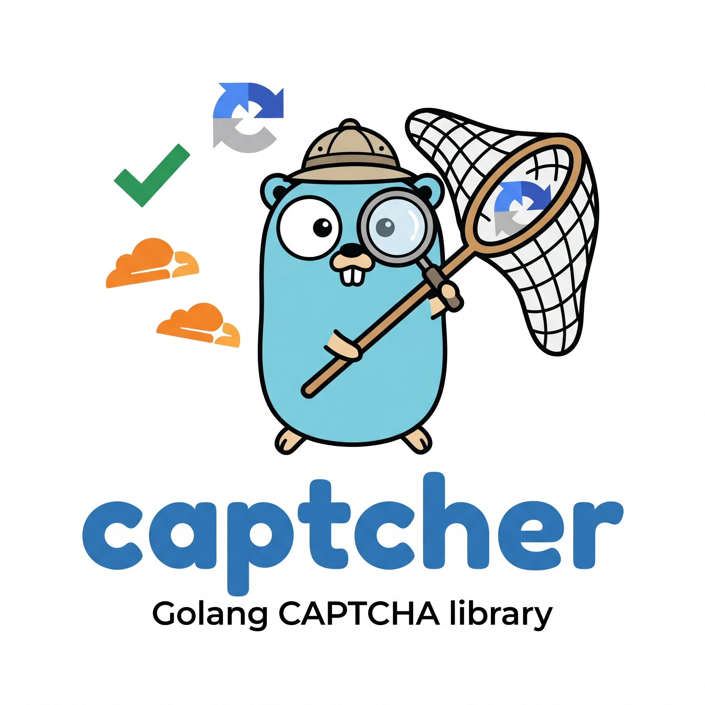

<p align="center">
  
</p>

# captcher

A universal Go library for CAPTCHA verification supporting Google reCAPTCHA (v2 and v3) and Cloudflare Turnstile. Swap providers without changing application code.

## Features

- **Unified interface** — `captcher.Verifier` abstracts over all providers
- **Google reCAPTCHA v2** — checkbox and invisible modes
- **Google reCAPTCHA v3** — score-based verification with configurable threshold and action validation
- **Cloudflare Turnstile** — with action, hostname, and customer data (CData) support
- **HTTP middleware** for net/http, Gin, and Echo
- **Functional options** for clean configuration
- **Context propagation** — verification results available downstream via `captcher.FromContext()`

## Install

```bash
go get github.com/leodeim/captcher
```

The core library (verifiers, options, context helpers, and the net/http
middleware) has **zero third-party dependencies**. The Gin and Echo adapters
live in separate modules so you only pull in a web framework if you actually
use its adapter:

```bash
# only if you use the Gin adapter
go get github.com/leodeim/captcher/middleware/ginmw

# only if you use the Echo adapter
go get github.com/leodeim/captcher/middleware/echomw
```

## Quick Start

### Direct Verification

```go
package main

import (
    "context"
    "fmt"

    "github.com/leodeim/captcher"
    "github.com/leodeim/captcher/recaptcha"
    "github.com/leodeim/captcher/turnstile"
)

func main() {
    // reCAPTCHA v2
    v2 := recaptcha.NewV2("YOUR_SECRET_KEY")
    resp, err := v2.Verify(context.Background(), captcher.VerifyRequest{
        Token:    "token-from-client",
        RemoteIP: "1.2.3.4", // optional
    })
    fmt.Println(resp.Success, err)

    // reCAPTCHA v3 with score threshold
    v3 := recaptcha.NewV3("YOUR_SECRET_KEY",
        captcher.WithScoreThreshold(0.7),
        captcher.WithExpectedAction("login"),
    )
    resp, err = v3.Verify(context.Background(), captcher.VerifyRequest{
        Token: "token-from-client",
    })
    fmt.Println(resp.Success, resp.Score, err)

    // Cloudflare Turnstile
    ts := turnstile.New("YOUR_SECRET_KEY",
        captcher.WithExpectedHostname("example.com"),
    )
    resp, err = ts.Verify(context.Background(), captcher.VerifyRequest{
        Token: "token-from-client",
    })
    fmt.Println(resp.Success, resp.CData, err)
}
```

### Swap Providers at Runtime

All providers implement `captcher.Verifier`, so you can switch based on configuration:

```go
func newVerifier(provider, secret string) captcher.Verifier {
    switch provider {
    case "recaptcha_v2":
        return recaptcha.NewV2(secret)
    case "recaptcha_v3":
        return recaptcha.NewV3(secret, captcher.WithScoreThreshold(0.5))
    case "turnstile":
        return turnstile.New(secret)
    default:
        panic("unknown provider: " + provider)
    }
}
```

## Middleware

All middleware packages extract the token from (in order): HTTP header, form field, query parameter. The verification result is stored in the request context and accessible via `captcher.FromContext()`.

### net/http

```go
import (
    "github.com/leodeim/captcher"
    "github.com/leodeim/captcher/middleware/stdhttp"
    "github.com/leodeim/captcher/turnstile"
)

verifier := turnstile.New("YOUR_SECRET_KEY")
cfg := captcher.DefaultMiddlewareConfig(verifier)
cfg.SkipPaths = []string{"/health", "/ready"}
cfg.IPHeader = "X-Forwarded-For"

mux := http.NewServeMux()
mux.HandleFunc("/login", func(w http.ResponseWriter, r *http.Request) {
    resp := captcher.FromContext(r.Context())
    // use resp.Success, resp.Score, etc.
})

handler := stdhttp.Middleware(cfg)(mux)
http.ListenAndServe(":8080", handler)
```

### Gin

```go
import (
    "github.com/gin-gonic/gin"
    "github.com/leodeim/captcher"
    "github.com/leodeim/captcher/middleware/ginmw"
    "github.com/leodeim/captcher/recaptcha"
)

verifier := recaptcha.NewV3("YOUR_SECRET_KEY", captcher.WithScoreThreshold(0.5))
cfg := captcher.DefaultMiddlewareConfig(verifier)

r := gin.Default()
r.Use(ginmw.Middleware(cfg))

r.POST("/submit", func(c *gin.Context) {
    resp := ginmw.VerifyResponseFromContext(c)
    // or: resp := captcher.FromContext(c.Request.Context())
})
```

### Echo

```go
import (
    "github.com/labstack/echo/v4"
    "github.com/leodeim/captcher"
    "github.com/leodeim/captcher/middleware/echomw"
    "github.com/leodeim/captcher/turnstile"
)

verifier := turnstile.New("YOUR_SECRET_KEY")
cfg := captcher.DefaultMiddlewareConfig(verifier)

e := echo.New()
e.Use(echomw.Middleware(cfg))

e.POST("/submit", func(c echo.Context) error {
    resp := echomw.VerifyResponseFromContext(c)
    // or: resp := captcher.FromContext(c.Request().Context())
    return c.JSON(200, resp)
})
```

## Middleware Configuration

| Field | Default | Description |
|---|---|---|
| `TokenHeader` | `"X-Captcha-Token"` | HTTP header to read the token from |
| `TokenFormField` | `"captcha_token"` | Form/query field to read the token from |
| `TokenQueryParam` | `""` (disabled) | Dedicated query parameter for the token |
| `IPHeader` | `""` | Header for client IP (e.g. `"X-Forwarded-For"`) |
| `SkipPaths` | `nil` | Exact paths to skip verification for |
| `Optional` | `false` | If true, failed verification doesn't block the request |

## Verifier Options

Options are shared across all providers via functional options:

```go
captcher.WithHTTPClient(client)       // custom *http.Client
captcher.WithTimeout(30 * time.Second) // request timeout (default: 10s)
captcher.WithScoreThreshold(0.7)       // reCAPTCHA v3 minimum score (default: 0.5)
captcher.WithExpectedAction("login")   // reCAPTCHA v3 / Turnstile action validation
captcher.WithExpectedHostname("example.com") // hostname validation
```

## Error Handling

All errors are sentinel values and can be checked with `errors.Is()`:

```go
resp, err := verifier.Verify(ctx, req)
if errors.Is(err, captcher.ErrScoreTooLow) {
    // reCAPTCHA v3 score below threshold — resp.Score has the actual score
}
if errors.Is(err, captcher.ErrVerifyFailed) {
    // verification failed — resp.ErrorCodes has provider-specific details
}
```

| Error | Meaning |
|---|---|
| `ErrMissingToken` | Empty token provided |
| `ErrVerifyFailed` | Provider rejected the token (or hostname/action mismatch) |
| `ErrScoreTooLow` | reCAPTCHA v3 score below threshold |
| `ErrHTTPRequest` | HTTP-level failure (network error, non-200 status) |
| `ErrInvalidResponse` | Provider returned unparseable JSON |
| `ErrTimeout` | Request context was cancelled or timed out |

## Testing

### Unit Tests

Unit tests use mock HTTP servers and run without network access:

```bash
go test ./...
```

### Integration Tests

Integration tests hit the real provider APIs using official test credentials:

- **Cloudflare Turnstile**: [dummy sitekeys and secret keys](https://developers.cloudflare.com/turnstile/troubleshooting/testing/) with deterministic pass/fail/duplicate outcomes
- **Google reCAPTCHA v2**: [public test keys](https://developers.google.com/recaptcha/docs/faq) that always pass verification
- **Google reCAPTCHA v3**: uses the v2 test secret (same endpoint) to validate the HTTP flow end-to-end (score is not meaningful)

Integration tests require network access and are gated behind a build tag:

```bash
go test -tags integration ./...
```

To run only integration tests:

```bash
go test -tags integration -run Integration ./...
```

### Test Coverage Summary

| Package | Unit Tests | Integration Tests |
|---|---|---|
| `captcher` | 7 | — |
| `recaptcha` | 15 | 11 (v2: 6, v3: 5) |
| `turnstile` | 10 | 10 |
| `middleware/stdhttp` | 9 | 6 |
| `middleware/ginmw` | 10 | 6 |
| `middleware/echomw` | 10 | 6 |
| **Total** | **61** | **39** |

## Project Structure

```
captcher/                     # core module (go.mod) — zero third-party deps
├── captcher.go              # Verifier interface, types, errors, options
├── middleware.go             # MiddlewareConfig, context helpers
├── internal/verify/          # Shared HTTP verification logic
├── recaptcha/                # Google reCAPTCHA v2 + v3
├── turnstile/                # Cloudflare Turnstile
├── middleware/
│   ├── stdhttp/              # net/http middleware (in core module)
│   ├── ginmw/                # Gin middleware — separate module (go.mod)
│   └── echomw/               # Echo middleware — separate module (go.mod)
└── example/                  # Runnable example — separate module (go.mod)
```

The Gin and Echo adapters are independent Go modules, so the core module's
dependency graph stays free of `gin`, `echo`, and their transitive trees. The
example depends on every adapter, so it is its own module too.

Run the example and pick a framework with the `FRAMEWORK` env var:

```bash
cd example
go run .                  # net/http (default)
FRAMEWORK=gin  go run .    # Gin
FRAMEWORK=echo go run .    # Echo
```

It first runs direct (no-middleware) verification against all three providers,
then starts an HTTP server on `:8080` using the selected framework's middleware.

## License

MIT
